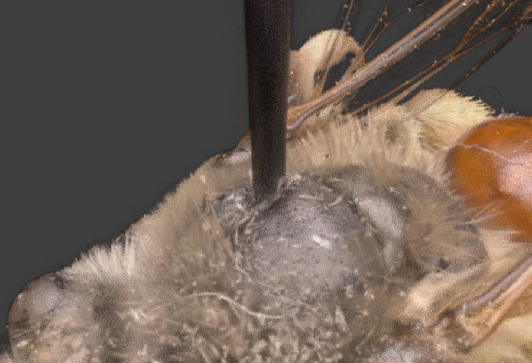
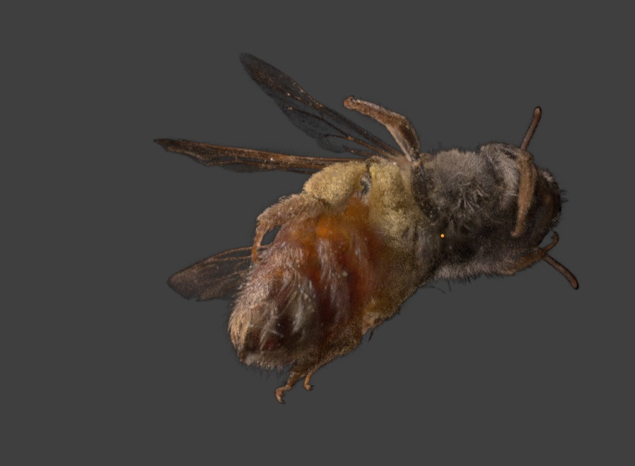
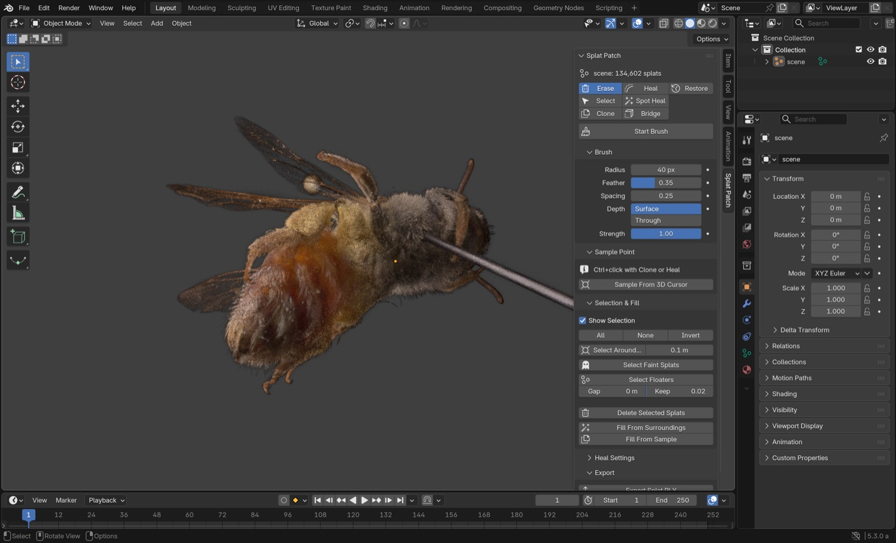
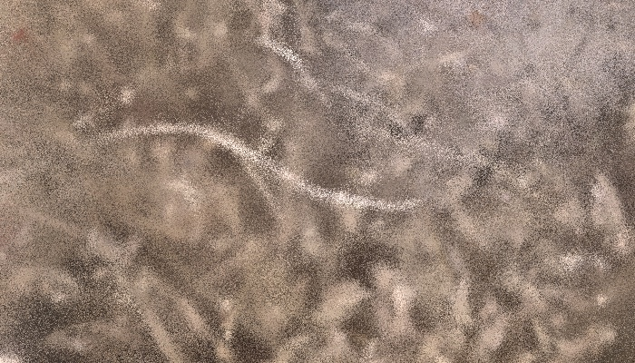
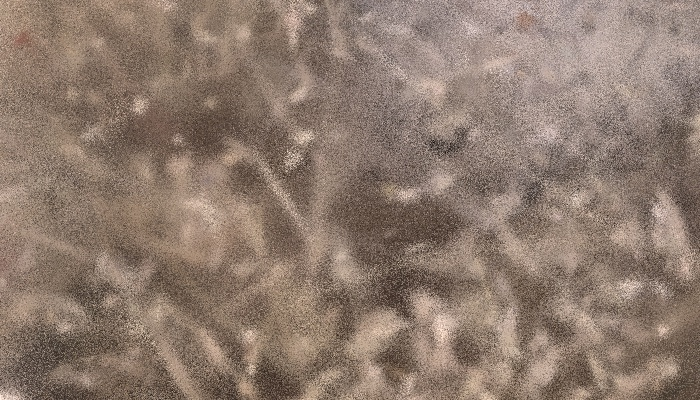
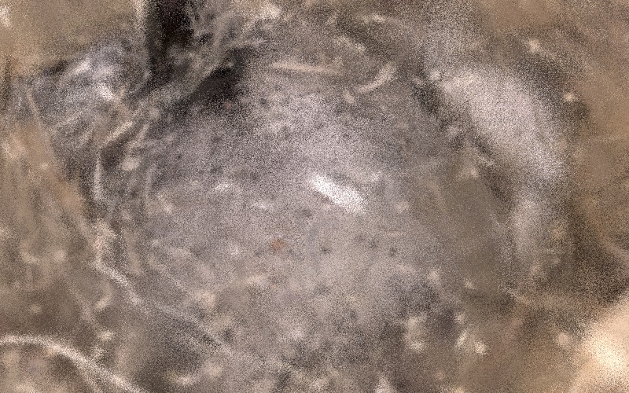
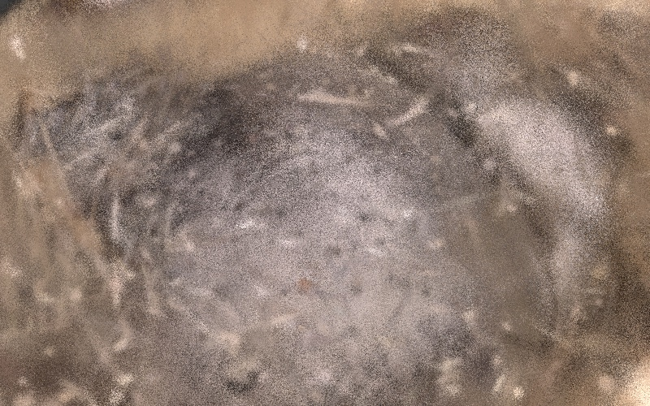
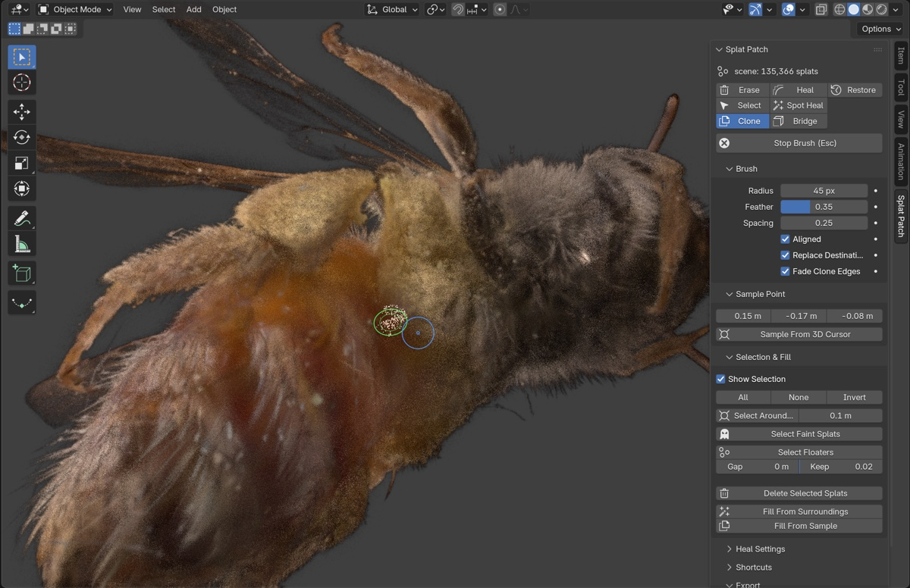
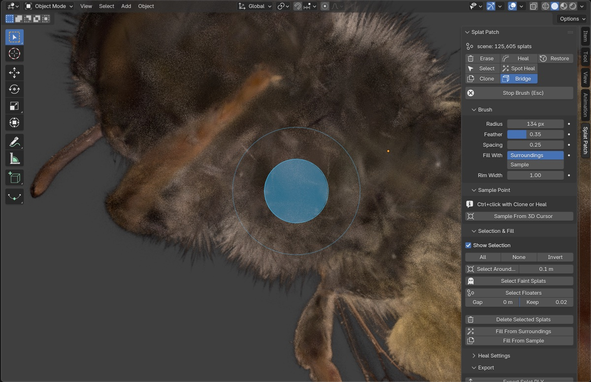
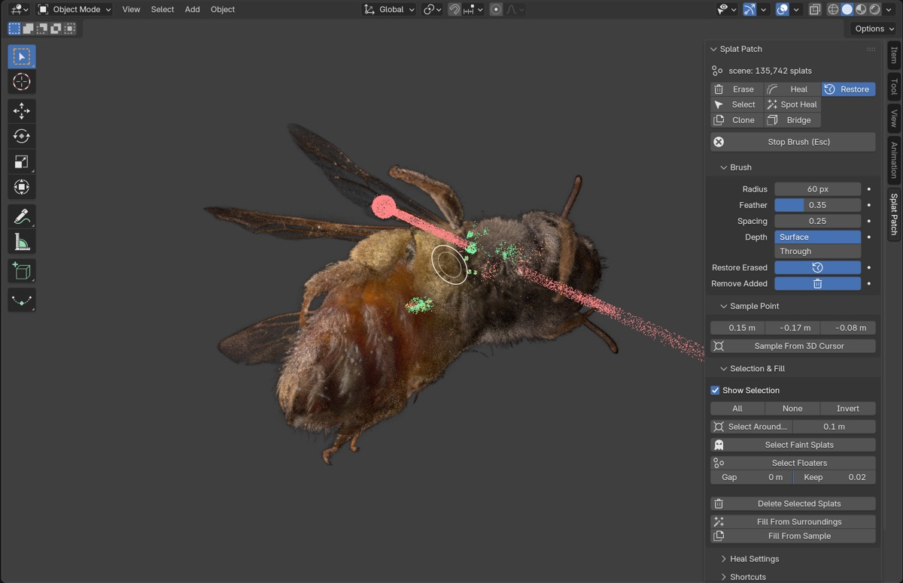

# Gaussian Splat Patch (Blender 5.3+)

Erase, clone stamp and heal 3D Gaussian splat scans inside Blender, using Blender 5.3's
native splat import (`File > Import > PLY / SPZ`). Built for cleaning insect specimens:
dust, stray hairs, and the pin and the hole it leaves.

Sidebar: **3D Viewport > N > Splat Patch**.

| Top of the thorax as scanned, with the pin | Pin erased, strays removed, hole bridged |
|---|---|
|  |  |



### Retouching dust and fibres

Close-ups from the same scan, same camera, before and after:

| Stray fibres lying on the hair: **Erase** along them with a small brush | |
|---|---|
|  |  |

| Dust on the body: **Spot Heal** over each speck | |
|---|---|
|  |  |

**Tip:** splats look much darker than they really are in Blender's default Solid lighting. In the
viewport's **Viewport Shading** dropdown, set **Lighting → Flat** to see the scan's true colours while editing.

## Install

Download `gs_patch-*.zip` from [Releases](https://github.com/timfennell/blender-splat-patch/releases),
then in Blender use **Edit > Preferences > Get Extensions > ⌄ > Install from Disk…** and pick the zip.
Requires Blender 5.3 or newer.

## Tools (brush)

Pick a tool button to start painting. While the brush is running:

| Key | Action |
|---|---|
| **Painting** | |
| LMB drag | paint with the current tool |
| Hold **Option / Alt** (or Ctrl) | Select: deselect instead of select. Checked on every dab, so press or release it mid-stroke |
| **Ctrl**+LMB (or Option/Alt+LMB) | Clone / Heal: set the sample point |
| **Tools** | |
| **E** or `1` | Erase |
| **S** or `2` | Select |
| **C** or `3` | Clone |
| **H** or `4` | Heal |
| **J** or `5` | Spot Heal |
| **B** or `6` | Bridge |
| **R** or `7` | Restore |
| **Brush** | |
| **F** | resize the brush: move the mouse, then click or F to set (Esc / right-click cancels) |
| **Shift F** | set the feather the same way |
| `[` `]` | smaller / larger brush |
| Shift `[` `]` | less / more feather |
| `X` | Surface ↔ Through depth (Through reaches every depth, e.g. a whole pin) |
| **Edit** | |
| **Delete** / Backspace | erase the selected splats |
| **Leaving** | |
| Esc / Enter | stop the brush (works with the mouse anywhere) |
| Ctrl+Z / ⌘Z | blocked while painting (use Restore); after you stop, it takes back the whole brush session |
| **View** | |
| MMB drag, scroll wheel, trackpad | orbit, zoom and pan as usual while painting |

Starting the brush switches Solid view to **Flat** lighting so the splats show their true colours. The
same list is in the panel under **Shortcuts**.

Strokes don't create Blender undo steps (on big scans each would copy the whole cloud): use the
**Restore** brush to undo edits anywhere.

- **Erase**: deletes splats; the feather fades them instead. Erase, Select and Spot Heal also work over
  empty space: with nothing solid under the brush (a white circle), they take everything under the
  circle at any depth. Needle-shaped splats count wherever their length crosses the brush, not just at
  their centre.
- **Select**: paints a region to use with the Selection & Fill buttons. Hold Option/Alt to deselect.


- **Clone**: works like Photoshop's clone stamp. Ctrl+click a clean area, then paint over the defect. The splats
  are rotated to fit the target surface's normal, including their view-dependent colour (SH bands 1–3),
  so highlights and sheen turn with the surface. *Aligned* keeps the offset between strokes.
  *Replace Destination* removes what was there, crossfading across the feather.
- **Heal**: clones like Clone, then shifts the colour to match the ring around the destination.
- **Spot Heal**: paint over a speck; it is deleted and new splats are grown from the surrounding surface.


- **Bridge**: for a hole that is already empty (e.g. after erasing a pin). Look at the hole and paint over
  it, a little onto the intact surface around it. The tool reads the surface in a rim around what you
  painted, keeping only the layer at the hole's edge (not the inside of the hole, or a leg or wing crossing
  the rim). It fits a gently curved surface across the gap and covers it with splats, either grown from
  the rim (*Fill With: Surroundings*) or cloned from the sample point and colour-matched (*Sample*).
  Anything deeper in the hole is left alone and ends up behind the new surface. Clone and Heal then work on
  top of the bridge. *Rim Width* sets how wide a ring is read, as a multiple of the brush radius.

## Restore (non-destructive edits)

Edits are recorded, so any part of the model can be taken back to the original scan:

- Splats that an edit removes (erase, clone's *Replace*, spot heal, fill, Delete Selected) aren't deleted:
  they're hidden in place (opacity 0) with their original opacity kept, and saved in the .blend.
- Splats that an edit adds are tagged, and splats that a feathered edit fades keep their original opacity.



With the **Restore** brush (`7`) active, splats added by edits show **green**, erased ones **red**
(at the place they were), and faded ones **yellow**. Paint to take the area under the brush back to the
original. The two toggles choose what a stroke does:

- **Restore Erased** brings back red splats and resets yellow ones to their original opacity.
- **Remove Added** deletes green splats.

Restoring everything returns the original scan exactly, every splat and attribute. **Export Splat PLY
bakes the edits**: the file contains only the visible result, and the stash stays in the .blend so you
can keep refining. Edits made before version 0.1.3 were not recorded and can't be restored.

## Selection & Fill (the sample / edit / fill volumes)

1. Select the volume to remove: paint with **Select**, use **Select Around Cursor** (sphere at the 3D
   cursor), **Select Faint Splats** (near-transparent haze), or **Select Floaters**. Floaters are clumps
   not connected to the specimen, such as wisps left where a pin was. *Gap* sets how far apart splats can
   be and still count as connected (0 = automatic). *Keep* protects clumps at least that fraction of the
   largest one, such as a detached leg.
2. **Delete Selected**, or
3. **Fill From Surroundings** (spot-heal the selection), or **Fill From Sample**: clone the area around
   the sample point into the gap, trimmed to the gap's footprint, feathered and colour-matched.

The fill fits a smooth surface to the ring of splats around the gap, finds the gap in that surface, and
fills it to the ring's density. Heal Settings (Border, Grain, Colour Smoothing, Density) tune it.

## Export

Blender 5.3's PLY exporter writes 0 points for a point cloud, so use **Export > Export Splat PLY**.
It writes the standard INRIA 3DGS layout that Brush, SuperSplat and Blender read. A round trip matches
the original file exactly. Positions are written in object space (the object transform is ignored).

## Limits

- **Built against the Blender 5.3 alpha.** The tool relies on how 5.3 stores splats (attributes such as
  `radiance:base`). If that changes before the final release, the tool will need an update.
- **Large scans:** on a 2-million-splat scan, starting the brush takes about 1¼ s, hovering and dabs a few
  milliseconds, and erase/select/restore strokes under 0.1 s. Strokes that add splats (Clone, Heal,
  Spot Heal, Bridge) take about 0.6 s, because Blender has to rewrite the whole cloud when it grows.
- **Erased splats stay in the .blend.** They're hidden, not deleted, so they can be restored; the file
  keeps its full size while you edit. Export Splat PLY leaves them out of the exported file.
- **Bridge rebuilds one surface layer.** Where the gap was thick with hair, the bridged patch can look
  smoother than its surroundings; a pass of Clone or Heal from a hairy area on top blends it in.
- **Restore only knows edits made with version 0.1.3 or later.** Earlier edits are permanent.
- **Tested on three bee scans:** standard 3DGS PLY files (one exported from Brush), up to 135k splats,
  plus a 2-million-splat test file. Other trainers' standard PLYs should load the same way.

## Development

```
blender --command extension build --source-dir gs_patch --output-dir dist
blender --command extension install-file -r user_default -e dist/gs_patch-0.1.0.zip
```
